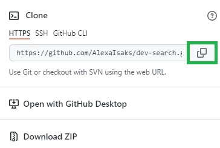
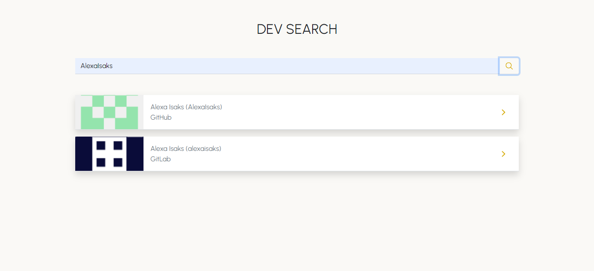
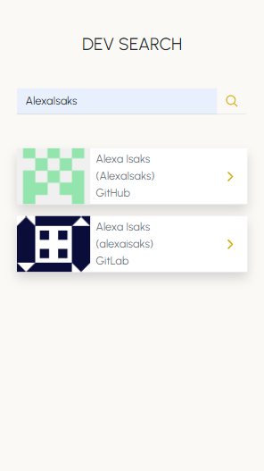
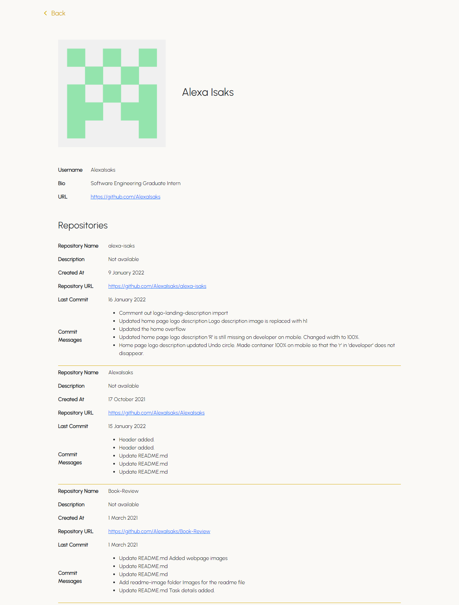
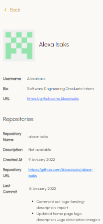

<h1 align="center">Dev Search API</h1>
Search for developers on GitHub and GitLab.

## Table of Contents

* [About the Project](#about-the-project)
* [Installation](#installation)
* [Usage](#usage)
* [Acknowledgments](#acknowledgments)

## About the Project

 

     

 

Dev Search API allows you to search for developers on GitHub and GitLab. Developers can be searched by their username. You will be able to view their basic profile and all their respositories.

The skills demonstrated in this project: 

* React
* Bootstrap 5
* SASS
* Node.js
* Express
* Creating an API

## Installation

* Select the green **Code** button  

  

* Select HTTPS and copy the URL 

   

* Open Git Bash.
* Change to the directory/folder where you want to clone the repository.
* To clone the repository, type `git clone` followed by the URL. 

  `$ git clone https://github.com/AlexaIsaks/dev-search.git`

* Press **Enter**. The repository will be cloned in your folder.

## Usage

* Open the dev-search folder in your favourite code editor.

* If you are using Visual Studio Code, open the built-in terminal and cd into the **frontend** folder. Otherwise use your command prompt terminal. 

* Enter **npm install** to install all the node modules.

* Enter **npm start** to run the application.

* The Dev Search application should open up in your browser.

* To search for a developer, enter the username in the search bar. Ensure that the spelling is correct.

* To view the developer details, click on the search result.

## Acknowledgments

**HyperionDev**

Certified Full Stack Web and Software Engineer 

